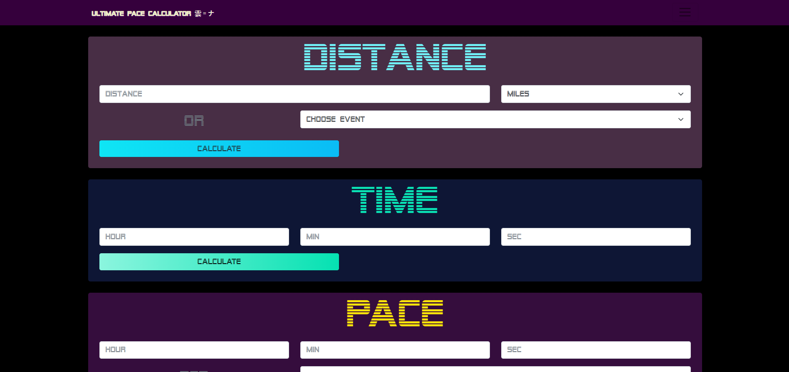

# Pace-Calculator 
  
# Description
This application is designed to be used by runners looking to make pace calculations for races or training runs. The app allows any calculation to be made based on pace, distance, or time. The user can also calculate their splits for a given interval.

# Table of Contents
- [Installation](#installation)

- [Usage](#usage)

- [License](#license)

- [Contributing](#contributing)

# Installation
This application can be found at the following [link](https://dmcaulay97.github.io/Pace-calculator/).

# Usage
To make a calculation two perameters need to be entered to calculate the third. The user can either enter their own perameters or choose from a list of options. Similarly, splits can be calculated as long as two perameters are given.

# License 
    This project uses the The MIT License license.
    
    License Link: https://opensource.org/licenses/MIT

# Contributing
N/A

# Tests
N/A

# Questions
Github: [dmcaulay97](https://github.com/dmcaulay97)

Email: dmcaulay97@gmail.com
  